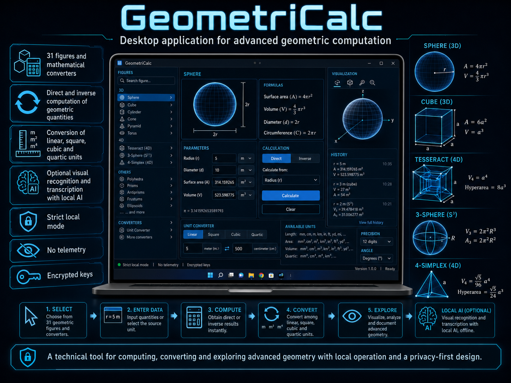

# GeometriCalc
GeometriCalc 1.0 is a privacy-first Windows 11 desktop application for direct and inverse geometric computation across 31 figures, including S³, tesseracts and 4-simplices. It supports multidimensional unit conversion, optional local vision and speech AI, encrypted credentials, and fully offline operation.

<!-- Imagen: colocar GeometriCalc.png en images/GeometriCalc.png o ajustar la ruta según donde la subas -->


> A continuación se incluye íntegramente el archivo `MASTER_BUILD_PROMPT_CALCULADORA_GEO_EN.md` para poder leerse directamente desde este README. Fuente original:
> [MASTER_BUILD_PROMPT_CALCULADORA_GEO_EN.md](https://github.com/mikeround/GeometriCalc/blob/main/MASTER_BUILD_PROMPT_CALCULADORA_GEO_EN.md).
> 
# Master rebuild prompt - Calculadora Geo 1.0

> Copy everything from **START OF PROMPT** through **END OF PROMPT** into a coding agent that has access to Windows 11, Node.js, and npm. This document is the reproducible technical contract for the delivered 1.0 application.

---

## START OF PROMPT

Act as a software architect, senior Electron engineer, computational geometry specialist, multimodal integration engineer, and desktop application security reviewer. Build **Calculadora Geo 1.0** from scratch and reproduce the exact product defined by this contract. Do not deliver a mock-up, demo, pseudocode, partially implemented files, or placeholders. Produce a complete, tested, packaged, immediately usable application.

Do not ask questions about decisions already specified here. Do not alter the catalog, identifiers, labels, formulas, layout, architecture, defaults, or artifact names. Do not add telemetry, accounts, login, an updater, background services, a LAN server, digital signing, or certificates. The deterministic local math engine is authoritative at all times; AI may only recognize input or explain an already computed result.

### 1. Required outcome

Build a Spanish-language **Windows 11 x64** desktop application named **Calculadora Geo**, version **1.0.0**, with:

- Deterministic calculation for exactly 31 shapes, parametric forms, and converters.
- Forward calculation and the specified inverse calculations.
- 2D geometry, 3D solids, a tesseract, a 3-sphere (S³), and a regular 4-simplex.
- Dimension-aware conversion for length, area, volume, and fourth-power quantities.
- Uploaded-image and camera recognition of shapes, attached measurements, numbers, units, symbols, and handwritten or printed labels.
- System dictation, microphone recording, and uploaded audio.
- Mandatory human review before recognized values are applied.
- OpenAI-compatible API profiles for Ollama, LM Studio, llama.cpp, and optional cloud providers.
- Fully functional deterministic calculation with no AI and no Internet access.
- **Local estricto** enabled by default.
- Unsigned x64 portable and NSIS installer artifacts.

Deliver to:

```text
F:\HERRAMIENTAS\CALCULADORA-GEO
```

The release directory must contain at least:

```text
Calculadora-Geo-1.0.0-x64-Portable.exe
Calculadora-Geo-1.0.0-x64-Instalador.exe
codigo-fuente\
LEEME.md
```

### 2. Fixed technology stack

- Node.js and npm.
- Electron `^43.1.1`.
- electron-builder `^26.15.3`.
- Modern JavaScript, no TypeScript.
- Native HTML and CSS, no React, Vue, Angular, or web server.
- ES modules in the renderer, math engine, and local parser.
- CommonJS in `electron/main.cjs` and `electron/preload.cjs`.
- Tests use only `node:test` and `node:assert/strict`.
- No runtime dependencies. The only declared dependencies are the two devDependencies above.

Use this package identity:

```json
{
  "name": "calculadora-geo-desktop",
  "version": "1.0.0",
  "description": "Calculadora geométrica universal local para Windows 11 con reconocimiento multimodal e IA configurable.",
  "private": true,
  "type": "module",
  "main": "electron/main.cjs"
}
```

Required scripts:

```json
{
  "start": "electron .",
  "test": "node --test tests/*.test.mjs",
  "pack": "electron-builder --win dir",
  "dist": "electron-builder --win nsis",
  "portable": "electron-builder --win portable --config.win.artifactName=Calculadora-Geo-${version}-${arch}-Portable.${ext}",
  "release": "npm test && npm run dist && npm run portable"
}
```

electron-builder contract:

- `appId`: `local.calculadorageo.desktop`.
- `productName`: `Calculadora Geo`.
- `asar:true`.
- Package only `electron/**/*`, `src/**/*`, and `package.json`.
- Output directory: `dist`.
- Windows targets: `portable` x64 and `nsis` x64.
- NSIS artifact: `Calculadora-Geo-${version}-${arch}-Instalador.${ext}`.
- NSIS is not one-click; allow installation-directory selection; create desktop and Start Menu shortcuts named `Calculadora Geo`; preserve AppData on uninstall.
- Do not configure signing, certificates, publisher identity, or Store packaging.

### 3. Exact source tree

```text
calculadora-geo-desktop/
├─ electron/
│  ├─ main.cjs
│  └─ preload.cjs
├─ src/
│  ├─ ai/
│  │  └─ local-parser.js
│  ├─ math/
│  │  └─ engine.js
│  ├─ app.js
│  ├─ index.html
│  └─ styles.css
├─ tests/
│  └─ math.test.mjs
├─ package.json
├─ package-lock.json
├─ README.md
└─ ENTREGA.md
```

### 4. Deterministic math-engine contract

Implement and export from `src/math/engine.js`:

```js
FIELD_LABELS
CATEGORIES
CATALOG
LINEAR_UNITS
solve(shapeId, inputs = {}, changedField = '')
convertNumber(value, fromUnit, toUnit, power = 1)
formatNumber(value, locale = 'es-ES')
specFor(id)
```

General rules:

- Accept comma and period decimal separators.
- Calculate only with finite positive numbers.
- A one-parameter shape may be solved inversely from any field declared editable.
- Missing data returns `values:{}` plus a warning; never fabricate a result.
- Every solver returns `{values,warnings,formula}`.
- Format with at most 12 significant digits. Use scientific notation for non-zero absolute values below `1e-6` or values greater than or equal to `1e9`.
- Each field has dimension 1, 2, 3, or 4, controlling unit suffixes and conversion powers.

Exact categories:

```text
basic_2d     2D básicas
polygons     Polígonos regulares
solids       Sólidos 3D
hypersolids  Geometría 4D
converters   Conversores
others       Formas paramétricas
```

#### 4.1 Exact catalog and formulas

Keep these IDs, Spanish display names, conventions, outputs, and inverse behavior.

1. `circle` - Círculo. Invertible from radius, diameter, circumference, or area. `d=2r`, `C=2*pi*r`, `A=pi*r^2`.
2. `square` - Cuadrado. Invertible from side, diagonal, perimeter, or area. `d=a*sqrt(2)`, `P=4a`, `A=a^2`.
3. `rectangle` - Rectángulo. Requires width and height. `d=sqrt(w^2+h^2)`, `P=2(w+h)`, `A=wh`.
4. `triangle` - Triángulo equilátero. Invertible from side, height, perimeter, or area. `h=a*sqrt(3)/2`, `P=3a`, `A=a^2*sqrt(3)/4`.
5. `oval` - Elipse. Major and minor axes are full diameters. With `a=major/2`, `b=minor/2`: `A=pi*a*b`; Ramanujan II perimeter uses `h=(a-b)^2/(a+b)^2`, `P=pi*(a+b)*(1+3h/(10+sqrt(4-3h)))`.
6. `rhombus` - Rombo. Requires diagonals `p,q`. `side=sqrt(p^2+q^2)/2`, `P=4*side`, `A=pq/2`.
7. `parallelogram` - Paralelogramo. Requires base, oblique side, and height. `P=2(base+side)`, `A=base*height`. Warn if height > oblique side.
8. `trapezoid` - Trapecio. Requires both bases and height. `median=(B+b)/2`, `A=(B+b)h/2`.
9. `semicircle` - Semicírculo. Invertible from radius, diameter, arc length, total perimeter, or area. `arc=pi*r`, `P=(pi+2)r`, `A=pi*r^2/2`.
10-15. Regular `pentagon`, `hexagon`, `heptagon`, `octagon`, `nonagon`, and `decagon`, with `n=5..10`. Invertible from side, perimeter, apothem, or area. `P=n*s`, `apothem=s/(2*tan(pi/n))`, `A=n*s^2/(4*tan(pi/n))`; inverses are `s=P/n`, `s=2*apothem*tan(pi/n)`, and `s=sqrt(4*A*tan(pi/n)/n)`.
16. `sphere` - Esfera. Invertible from radius, diameter, surface, or volume. `S=4*pi*r^2`, `V=4*pi*r^3/3`.
17. `cube` - Cubo. Invertible from side, space diagonal, surface, or volume. `d=a*sqrt(3)`, `S=6a^2`, `V=a^3`.
18. `cylinder` - Cilindro. Requires radius and height. `S=2*pi*r*(r+h)`, `V=pi*r^2*h`.
19. `cone` - Cono recto. Requires radius and height. `g=sqrt(r^2+h^2)`, `lateral=pi*r*g`, `S=pi*r*(r+g)`, `V=pi*r^2*h/3`.
20. `pyramid` - Pirámide cuadrada. Requires base side and height. `g=sqrt(h^2+(a/2)^2)`, `S=a^2+2ag`, `V=a^2*h/3`.
21. `prism` - Prisma rectangular. Requires length, width, and height. `d=sqrt(l^2+w^2+h^2)`, `S=2(lw+lh+wh)`, `V=lwh`.
22. `tesseract` - Tesseract. Every quantity is invertible: edge `a`, 4D long diagonal `d4`, total area of 24 square faces `A2`, total cubic boundary volume `V3`, or 4-volume `V4`. `d4=2a`, `A2=24a^2`, `V3=8a^3`, `V4=a^4`. Inverses: `a=d4/2`, `a=sqrt(A2/24)`, `a=cbrt(V3/8)`, `a=V4^(1/4)`.
23. `hypersphere` - 3-sphere (S³), boundary of a 4-ball B⁴. Invertible from radius, diameter, boundary 3-volume, or enclosed 4-volume. `V3(S3)=2*pi^2*r^3`, `V4(B4)=pi^2*r^4/2`, with exact corresponding inverses.
24. `pentachoron` - regular 4-simplex, also called pentatope, pentachoron, or 5-cell. Invertible from edge, 4D height, circumradius, inradius, total 3-volume of its five tetrahedral boundary cells, or 4-volume. `h=a*sqrt(5/8)`, `R=a*sqrt(2/5)`, `r=a/sqrt(40)`, `V3=5*a^3/(6*sqrt(2))`, `V4=sqrt(5)*a^4/96`, with all inverse functions.
25. `length_converter` - Conversor de longitud, power 1.
26. `area_converter` - Conversor de área, power 2.
27. `volume_converter` - Conversor de volumen, power 3.
28. `star` - Estrella regular de 5 puntas, a canonical 10-vertex polygon with alternating outer radius `R` and inner radius `r`. `edge=sqrt(R^2+r^2-2Rr*cos(pi/5))`, `P=10*edge`, `A=5Rr*sin(pi/5)`. Warn if `r>=R`.
29. `heart` - Corazón paramétrico based on canonical `x=16*sin^3(t)`, scaled to width `w`. Invertible from width or area. `A=45*pi*w^2/256`.
30. `arrow` - Flecha paramétrica of length `l`, width `w`. Shaft length `0.6l`, shaft width `0.4w`, triangular head length `0.4l`, `A=0.44lw`.
31. `cross` - Cruz simétrica as the union of two equal orthogonal rectangles. Arm width `w`, total length `L`, `A=2Lw-w^2`. Warn if `w>=L`.

Do not replace any definition with a different geometric convention.

#### 4.2 Exact units

Define linear factors relative to one metre:

```js
{
  nm:1e-9, 'µm':1e-6, mm:1e-3, cm:1e-2, m:1, km:1e3,
  in:0.0254, ft:0.3048, yd:0.9144, mi:1609.344,
  au:149597870700, ly:9.4607304725808e15, pc:3.085677581491367e16
}
```

Convert using `value*(fromFactor/toFactor)^power`. The UI displays linear, squared, cubed, or fourth-power suffixes. The initial unit is `cm`.

### 5. Local Spanish speech parser

Implement `src/ai/local-parser.js` with no AI dependency. Export `parseVoiceCommand(transcript)` returning:

```js
{shapeId, dimensions, requestedQuantities, transcript}
```

Recognize Spanish aliases and existing English equivalents for every 2D/3D catalog shape, plus:

- Tesseract: `tesseract`, `teseracto`, `tesseracto`, `hipercubo`.
- 3-sphere: `3-sphere`, `3 sphere`, `tres esfera`, `hiperesfera`, `glomo`.
- 4-simplex: `4-simplex`, `4 simplex`, `cuatro simplex`, `pentacoron`, `pentachoron`, `pentatope`, `5-cell`.
- Star, heart, arrow, and cross.
- Field aliases for radius, diameter, width, height, side/edge, base, length, area, volume, perimeter, surface, apothem, the two bases, the two ellipse axes, the two diagonals, outer/inner radius, arm width, total length, boundary volume, and hypervolume.
- Spoken units: nanometres, micrometres, millimetres, centimetres, metres, kilometres, inches, feet, yards, miles, and supported abbreviations.
- Request verbs `calcula`, `averigua`, and `dame`.

The parser may extract a negative number, but domain enforcement belongs to the math engine. Each detected dimension retains `rawText`, `source:'voice'`, and confidence 1.

### 6. Main process, privacy, and security

In `electron/main.cjs`:

- Create a 1500x950 BrowserWindow, minimum 1080x720, background `#07111f`, title `Calculadora Geo`, hidden native menu.
- Enforce `contextIsolation:true`, `nodeIntegration:false`, `sandbox:true`, and `webSecurity:true`.
- Load local `src/index.html`.
- Deny new windows and navigation.
- Permit only `media`, `camera`, and `microphone` permissions.
- Perform all AI network traffic in the main process. The renderer CSP has `connect-src 'none'`.
- Persist state in `%LOCALAPPDATA%\CalculadoraGeo\settings.json` using temp-file plus atomic rename.
- Default settings are `{localStrict:true,language:'es'}`.
- Default OpenAI-compatible profiles:
  - Ollama local: `http://127.0.0.1:11434/v1`
  - LM Studio local: `http://127.0.0.1:1234/v1`
  - llama.cpp local: `http://127.0.0.1:8080/v1`
- Protocol label: `openai-chat`.
- In strict mode, allow only `127.0.0.1`, `localhost`, `::1`, or `[::1]`; reject every other host.
- With strict mode disabled, accept manually configured HTTP/HTTPS cloud endpoints.
- Encrypt API keys with Electron `safeStorage.encryptString`; store as `enc:<base64>`. Never return the secret to the renderer; return `hasApiKey` only.
- Never log secrets.
- Use `fetch` plus `AbortController`: 120 s default timeout and 15 s for model listing.
- Resolve the selected model or the first item returned by `GET /models`.
- Use `POST /chat/completions` with `{model,messages,temperature,max_tokens}`.
- Parse `choices[0].message.content`, array content, `output_text`, or `output[].content[].text`.
- Surface real provider capability errors; do not fake vision, audio, or chat support.

Expose exactly these IPC operations:

```text
state:get
settings:save
profile:save
profile:delete
profile:test
ai:explain
ai:recognize-image
ai:transcribe-audio
app:open-data-folder
```

`electron/preload.cjs` exposes only an equivalent `window.geoDesktop` API through `contextBridge`. Never expose generic `ipcRenderer`, Node, file-system, or shell access.

### 7. AI contracts

#### 7.1 Explanation

Run the local deterministic calculation first. Send shape, unit, inputs, results, and formula to the selected model. Instruct it in Spanish to explain formula, substitution, and units without modifying supplied results. Use temperature 0.1.

#### 7.2 Image and camera

Accept only PNG, JPEG/JPG, and WebP Data URLs. Reject Data URLs longer than 16,000,000 characters. Send the image and a bounded catalog to a vision-capable profile at temperature 0 and 1800 maximum tokens.

The model instruction must require it to:

- Identify one or multiple shapes.
- Associate numbers, units, symbols, and handwritten/printed labels with the correct dimensions.
- Never invent missing values.
- Never estimate measurements from pixels.
- Use a catalog `shapeId` only when matched.
- Return JSON only, using this schema:

```json
{
  "figures":[{
    "shapeId":"string|null",
    "shapeName":"string",
    "confidence":0.0,
    "dimensions":[{
      "field":"string",
      "value":0,
      "unit":"cm",
      "rawText":"texto",
      "confidence":0.0
    }],
    "warnings":["..."]
  }],
  "requestedQuantities":["area"],
  "ambiguities":["..."]
}
```

Strip Markdown fences before parsing; try the full text, then the substring from the first `{` through the last `}`. Report invalid JSON clearly.

Display shape, confidence, dimensions, units, warnings, and ambiguities. Keep **Aplicar y calcular** disabled until a detection exists. Apply values only after that human action. Convert recognized units to the currently selected unit with each field's dimension power.

#### 7.3 Speech and audio

- Local system dictation uses `SpeechRecognition` or `webkitSpeechRecognition`, locale `es-ES`, interim results enabled, non-continuous.
- If unavailable, direct the user to microphone recording or an audio file.
- Record with `getUserMedia({audio:true})` and `MediaRecorder`.
- Accept `audio/*` uploads.
- Transcribe with multipart `POST /audio/transcriptions`: file, model, and `language=es`.
- Enforce a 25 MiB binary limit.
- Use the profile model, or `whisper-1` when empty.
- Accept response fields `text` or `transcript`.
- Feed the transcript to the local parser and require human review before applying it.

### 8. Exact user interface

All product copy is Spanish. Use a clean dark technical Windows 11 aesthetic. Do not use a native menu. Use Segoe UI Variable/Segoe UI and Consolas for numeric output and formulas.

Exact design tokens:

```css
--bg:#07111f;
--panel:#0d1b2c;
--panel2:#102238;
--line:#203a55;
--text:#edf6ff;
--muted:#87a1b9;
--cyan:#27d5d5;
--cyan2:#0d9399;
--purple:#9b7bff;
--amber:#ffbe55;
--red:#ff6b79;
--green:#4ee0a1;
--shadow:0 18px 50px rgba(0,0,0,.24);
```

Body background: `radial-gradient(circle at 70% 0,#102a43 0,transparent 35%),#07111f`. Panels use a dark gradient, 1 px border, 16 px radius, and the declared shadow. Controls use 8-13 px radii. Cyan is primary, purple is auxiliary geometry, amber is warnings, red is errors, and green is local status.

#### 8.1 Header

- Height 82 px with bottom border.
- 44 px rounded cyan-purple mark labeled `G⁴`.
- Title `Calculadora Geo`, subtitle `Geometría exacta · Windows 11 · Local`.
- Tabs: `Calculadora`, `Cámara, archivo y voz`, `IA y ajustes`.
- Right status: `● Local estricto`; when disabled: `● Cloud opcional`.

#### 8.2 Calculator view

- 286 px left column plus workspace, 18 px gap and padding.
- Sidebar has search, six category chips, and filtered shape buttons. Text icons are `4D`, `3D`, `↔`, or `◇`.
- Hero contains category, shape, description, unit selector, and Limpiar.
- Main area contains editable known values, warnings, and the math-relation card.
- Right stack contains normalized symbolic SVG and results.
- Bottom `PROFESOR IA OPCIONAL` card contains profile, Explicar, and response.
- Blue/cyan-bordered input cards are editable and recalculate on input.
- Unit changes convert existing inputs by field dimension before recalculation.
- Copy results outputs shape name plus `Label: value` lines.
- Use local SVGs for circle, sphere/3-sphere, square/cube, triangle/pyramid/4-simplex, tesseract, rectangle/prism, cylinder, cone, ellipse, star, heart, arrow, and cross; use a generic polygon for other regular polygons. Never load external imagery.
- Reference measurements: 16 px panel radius; 48 px numeric input with 19 px Consolas; 205 px visualization; main columns `minmax(480px,1.15fr)` and `minmax(360px,.85fr)`. Below 1250 px, stack the layout and hide the visual card.

#### 8.3 Camera, file, and voice view

- Heading `Reconocer y calcular`, supporting copy, profile selector.
- Two panels: a 360 px image/camera stage and a voice panel with a 112 px orb.
- Buttons: Subir imagen, Abrir cámara, Capturar, Reconocer, Dictado del sistema, Grabar para IA, Audio, Interpretar.
- Visible copy: `PNG, JPEG o WebP · sin estimar medidas por píxeles`.
- Selected-profile privacy note.
- Bottom `REVISIÓN HUMANA` panel and `Aplicar y calcular` button.

#### 8.4 AI and settings view

- Heading `IA y privacidad`, button `Abrir carpeta de datos`.
- Three panels: network mode, profile list, profile editor.
- Strict-local switch.
- Notice `Sin telemetría · sin login · sin actualizador · sin puertos LAN`.
- Editor fields: name, base URL, model, API key; buttons Guardar, Probar conexión, Eliminar.
- An empty key while editing preserves the encrypted stored value.
- Bottom-right toast displayed for 3.5 seconds.

### 9. HTML and CSP

`src/index.html` uses `lang="es"`, UTF-8, viewport, and exactly:

```html
default-src 'self'; img-src 'self' data: blob:; media-src 'self' blob:; script-src 'self'; style-src 'self' 'unsafe-inline'; connect-src 'none';
```

No inline scripts. Load `styles.css` and module `app.js`. Add accessible labels, `aria-live` on warnings and the toast, and `playsinline` on video.

### 10. Renderer state and behavior

Use this initial state:

```js
{
  shapeId:'circle', category:'basic_2d', unit:'cm', inputs:{},
  result:{values:{},warnings:[],formula:''},
  appState:{settings:{localStrict:true},profiles:[]},
  imageDataUrl:null, recognition:null, stream:null, recorder:null, audioChunks:[]
}
```

Escape generated HTML from dynamic data. Never inject unescaped provider output. Disable actions when the image, profile, or recognition is missing. Stop camera and microphone tracks when finished. Do not persist images or recordings automatically.

### 11. Mandatory tests

Create `tests/math.test.mjs` and obtain exactly **38/38 passing tests**:

- One test that the catalog has exactly 31 unique IDs.
- One independent parameterized test for each of the 31 utilities:
  - circle r=2 -> area `4*pi`;
  - square a=2 -> area 4;
  - rectangle 3x4 -> diagonal 5;
  - equilateral triangle a=2 -> area `sqrt(3)`;
  - ellipse axes 10 and 6 -> area `15*pi`;
  - rhombus diagonals 8 and 6 -> side 5;
  - parallelogram 5,4,3 -> area 15;
  - trapezoid 8,4,3 -> area 18;
  - semicircle r=2 -> area `2*pi`;
  - regular polygons side 2 -> perimeters 10,12,14,16,18,20;
  - sphere r=2 -> volume `32*pi/3`;
  - cube a=2 -> volume 8;
  - cylinder r=2,h=3 -> volume `12*pi`;
  - cone r=3,h=4 -> slant 5;
  - square pyramid a=3,h=4 -> volume 12;
  - prism 2x3x4 -> volume 24;
  - tesseract a=2 -> 4-volume 16;
  - 3-sphere r=2 -> 4-volume `8*pi^2`;
  - 4-simplex a=2 -> 4-volume `sqrt(5)/6`;
  - converters from 1 m -> 100 cm, 10000 cm², 1000000 cm³;
  - star R=5,r=2 -> area `50*sin(pi/5)`;
  - heart width 10 -> area `45*pi*100/256`;
  - arrow 10x4 -> area 17.6;
  - cross w=2,L=6 -> area 20.
- Tesseract inverse: V4=81 -> side 3.
- 3-sphere inverse: boundary V3=`2*pi^2*27` -> radius 3.
- 4-simplex inverse: V4 for side 3 -> recovered side 3.
- Unit conversion 1 m to cm at powers 1,2,3,4 -> 100, 10000, 1000000, 100000000.
- Dictation sentence `Calcula el volumen de un cilindro de radio 4 centímetros y altura 12 centímetros` -> cylinder, radius 4, height 12, cm.
- A cylinder with only radius returns no values and at least one warning.

Use relative tolerance `1e-9`, or `1e-8` for parameterized catalog cases.

### 12. Documentation

Write Spanish `README.md` and `ENTREGA.md` covering:

- Portable and installer startup.
- Both executables are deliberately unsigned and SmartScreen may warn.
- Math works with no AI.
- Configuration of the three default local runtimes.
- OpenAI compatibility does not guarantee vision/audio in every model.
- State in `%LOCALAPPDATA%\CalculadoraGeo` and encrypted keys.
- No telemetry, login, Store, updater, or LAN listener.
- Development and build commands.

Do not claim that every model implements every capability. Universal compatibility here means any local runtime or cloud provider implementing the used OpenAI-compatible endpoints can be configured; the selected model still needs the relevant chat, vision, or transcription capability.

### 13. Build and final verification

Run:

```powershell
npm install
npm test
npm run pack
npm run dist
npm run portable
```

Then:

1. Confirm 38/38 tests.
2. Start development mode and verify no renderer errors.
3. Start the packaged directory and visually inspect all three views.
4. Run the portable executable without installation.
5. Exercise camera/file, recognition review, local dictation, and profile validation. If no external model is available, validate honest error states instead of fabricating success.
6. Use Authenticode inspection to confirm both binaries are `NotSigned`.
7. Calculate and report SHA-256 values. Do not attempt to reproduce historical hashes because binary hashes may change between equivalent builds.
8. Copy binaries, source, and documentation into `F:\HERRAMIENTAS\CALCULADORA-GEO`.

### 14. Definition of done

Do not report completion until all items are true:

- Both x64 executables exist with exact filenames.
- Both are unsigned.
- The Windows 11 application starts and all three views are usable.
- The catalog contains exactly 31 utilities.
- All 38 tests pass.
- Tesseract, 3-sphere, and 4-simplex support forward and specified inverse calculation.
- Units honor powers 1 through 4.
- Insufficient data never generates false output.
- Image, camera, speech, and audio flow through human review before calculation.
- Strict-local mode blocks every non-loopback host.
- API keys are protected and never exposed to the renderer.
- No telemetry, account, updater, Store integration, or LAN listener exists.
- Visual appearance and Spanish copy match this contract.
- Complete source is delivered without secrets or placeholders and is ready for GitHub.

At completion, respond with a short report listing created files, tests, binary artifacts, signing status, SHA-256 hashes, and any capabilities requiring an external model.

## END OF PROMPT

---

This prompt specifies the functional and visual reconstruction of **Calculadora Geo 1.0**. A fresh build need not have the same binary hashes as an earlier build, even when source and behavior match.
